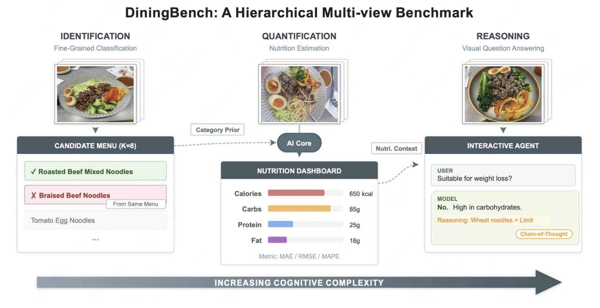
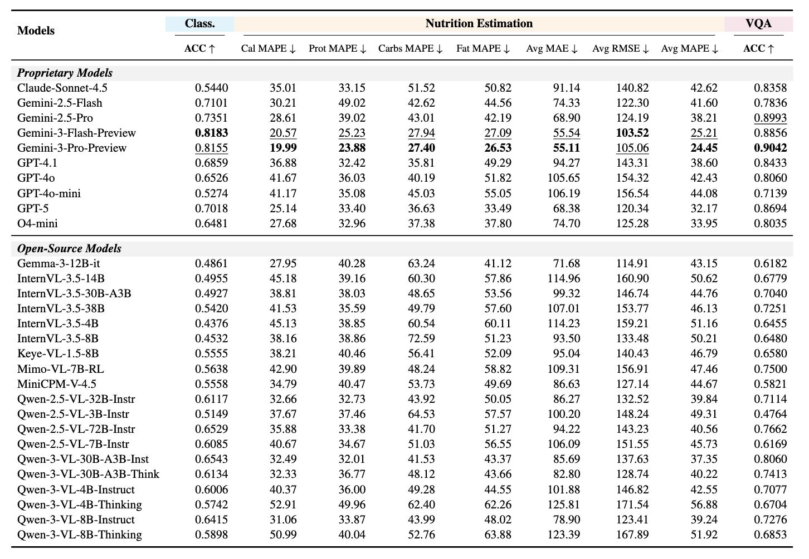

# DiningBench: A Hierarchical Multi-view Benchmark for Perception and Reasoning in the Dietary Domain

<div align="center">
  
  <a href="https://arxiv.org/abs/2604.10425">
    
  </a>
  
  <a href="https://huggingface.co/datasets/meituan/DiningBench">
    
  </a>
  
</div>

>Recent advancements in Vision-Language Models (VLMs) have revolutionized general visual understanding. However, their application in the food domain remains constrained by benchmarks that rely on coarse-grained categories, single-view imagery, and inaccurate metadata. To bridge this gap, we introduce DiningBench, a hierarchical, multi-view benchmark designed to evaluate VLMs across three levels of cognitive complexity: Fine-Grained Classification, Nutrition Estimation, and Visual Question Answering. Unlike previous datasets, DiningBench comprises 3,021 distinct dishes with an average of 5.27 images per entry, incorporating fine-grained "hard" negatives from identical menus and rigorous, verification-based nutritional data. We conduct an extensive evaluation of 29 state-of-the-art open-source and proprietary models. Our experiments reveal that while current VLMs excel at general reasoning, they struggle significantly with fine-grained visual discrimination and precise nutritional reasoning. Furthermore, we systematically investigate the impact of multi-view inputs and Chain-of-Thought reasoning, identifying five primary failure modes. DiningBench serves as a challenging testbed to drive the next generation of food-centric VLM research.

<div align="center">

</div>

## 🕹️ Environment Setup

### Step 1: Create Virtual Environment

```bash
conda create --name diningbench python=3.10
conda activate diningbench
```

### Step 2: Install Dependencies

```bash
pip install --upgrade pip setuptools
pip install -r requirements.txt
```

### Step 3: Start vLLM Server (Optional, for open-source models)

```bash
nohup vllm serve "$MODEL_PATH" \
    --port $PORT \
    --gpu-memory-utilization 0.8 \
    --max-model-len $MAX_MODEL_LEN \
    --served-model-name "$MODEL_NAME" \
    --tensor-parallel-size $SUGGESTED_TP \
    --max-num-seqs 32 \
    --trust-remote-code > "$VLLM_LOG" 2>&1 &
```

> **Note:** This step is optional and only required when using open-source models. For proprietary models with API access, you can skip this step and directly use the API endpoint.

---

## 🚀 Quick Start

### 1. Fine-Grained Classification

Run inference and evaluation for fine-grained classification:

```bash
python3 eval_classification.py \
  --resume \                                    # Resume from previous checkpoint if exists
  --infer \                                     # Run inference
  --evaluate \                                  # Run evaluation after inference
  --api_url "$API_URL" \                        # API endpoint URL
  --api_key "$API_KEY" \                        # API key for authentication
  --test_jsonl_path "$TEST_JSONL_PATH" \        # Path to test JSONL file
  --output_pred_jsonl "$OUTPUT_PRED_JSONL" \    # Path to output prediction JSONL file
  --model_name "$MODEL_NAME" \                  # Model name identifier
  --max_workers $MAX_WORKERS \                   # Maximum number of worker threads
  --num_images_idxs $NUM_IMAGES_IDXS             # Image indices to use: 0 for first image, 0,1,2 for first three images
  --rpm $RPM                                     # Requests per minute limit for API (Optional for proprietary models)
```

### 2. Nutrition Estimation

Run inference and evaluation for nutrition estimation:

```bash
python3 eval_nutrition.py \
  --resume \                                    # Resume from previous checkpoint if exists
  --infer \                                     # Run inference
  --evaluate \                                  # Run evaluation after inference
  --api_url "$API_URL" \                        # API endpoint URL
  --api_key "$API_KEY" \                        # API key for authentication
  --test_jsonl_path "$TEST_JSONL_PATH" \        # Path to test JSONL file
  --output_pred_jsonl "$OUTPUT_PRED_JSONL" \    # Path to output prediction JSONL file
  --model_name "$MODEL_NAME" \                  # Model name identifier
  --max_workers $MAX_WORKERS \                   # Maximum number of worker threads
  --num_images_idxs $NUM_IMAGES_IDXS             # Image indices to use: 0 for first image, 0,1,2 for first three images
  --rpm $RPM                                     # Requests per minute limit for API (Optional for proprietary models)
```

### 3. Visual Question Answering

#### Step 3.1: Run Inference

```bash
python3 eval_vqa.py \
  --resume \                                    # Resume from previous checkpoint if exists
  --infer \                                     # Run inference
  --api_url "$API_URL" \                        # API endpoint URL
  --api_key "$API_KEY" \                        # API key for authentication
  --test_jsonl_path "$TEST_JSONL_PATH" \        # Path to test JSONL file
  --output_pred_jsonl "$OUTPUT_PRED_JSONL" \    # Path to output prediction JSONL file
  --model_name "$MODEL_NAME" \                  # Model name identifier
  --max_workers $MAX_WORKERS \                   # Maximum number of worker threads
  --num_images_idxs $NUM_IMAGES_IDXS             # Image indices to use: 0 for first image, 0,1,2 for first three images
  --rpm $RPM                                     # Requests per minute limit for API (Optional for proprietary models)
```

#### Step 3.2: Evaluate Results

```bash
python3 eval_vqa.py \
  --evaluate \                                  # Run evaluation
  --model_evaluate \                            # Use model for evaluation
  --evaluate_api "$EVALUATE_API" \              # Evaluation API endpoint URL
  --evaluate_api_key "$EVALUATE_API_KEY" \      # Evaluation API key for authentication
  --evaluate_model_name "$EVALUATE_MODEL_NAME" \ # Evaluation model name identifier
  --evaluate_max_workers $EVALUATE_MAX_WORKERS \ # Maximum number of evaluation worker threads
  --evaluate_rpm $EVALUATE_RPM \                # Requests per minute limit for evaluation API
  --test_jsonl_path "$TEST_JSONL_PATH" \        # Path to test JSONL file
  --output_pred_jsonl "$OUTPUT_PRED_JSONL" \    # Path to input prediction JSONL file
  --output_eval_jsonl "$OUTPUT_EVAL_JSONL" \    # Path to output evaluation JSONL file
  --num_images_idxs $NUM_IMAGES_IDXS             # Image indices to use: 0 for first image, 0,1,2 for first three images
```

---

## 📊 Main Results

<div align="center">

</div>

